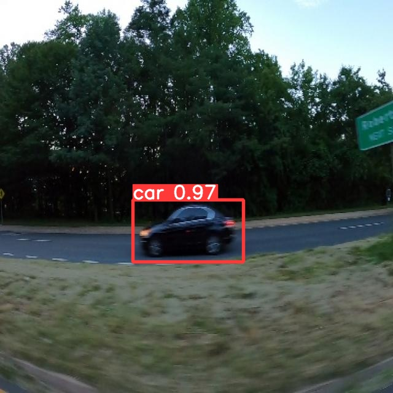

# Car Object Detection with Deep Learning

## Overview

This repository contains a deep learning model for car object detection. The model is trained to detect cars in images using state-of-the-art techniques in computer vision and deep learning.

## Dataset

The dataset used for training and evaluation can be accessed from the following Kaggle link: [Car Object Detection Dataset](https://www.kaggle.com/datasets/sshikamaru/car-object-detection).

## Data Labeling

To label the data and create bounding boxes for the car objects, we used the Roboflow platform: [Roboflow](https://roboflow.com/).

## Model

The deep learning model is based on the YOLOv3 architecture and was implemented using the Ultralytics library. You can find detailed documentation for the Ultralytics library at: [Ultralytics Documentation](https://docs.ultralytics.com/).

## Note

This project demonstrates the application of deep learning for car object detection. The performance of the model may vary depending on the quality and size of the dataset used for training.

Feel free to explore and adapt the project to suit your specific use cases. If you have any questions or need additional information, don't hesitate to ask. Happy car object detection!

